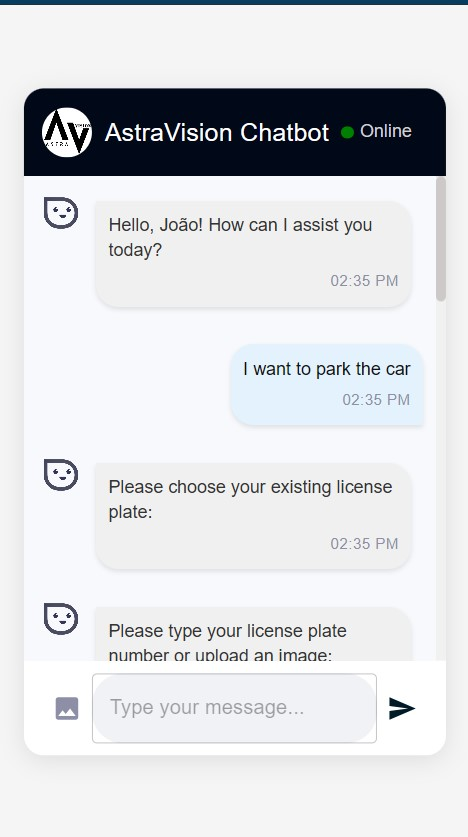
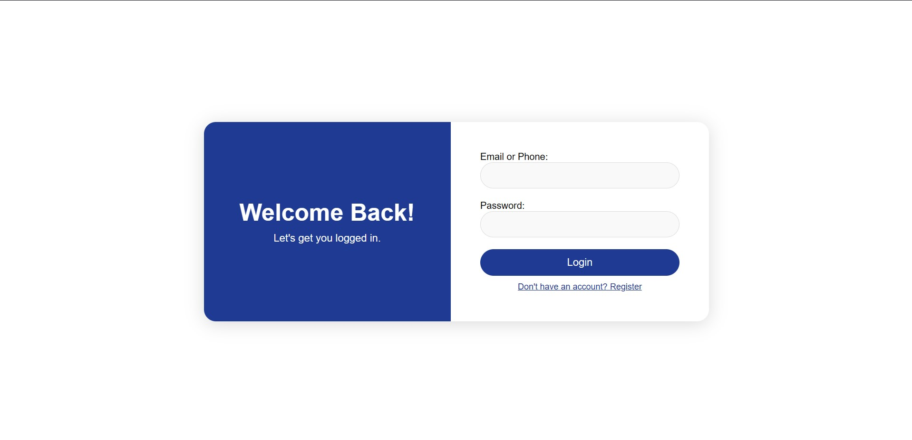
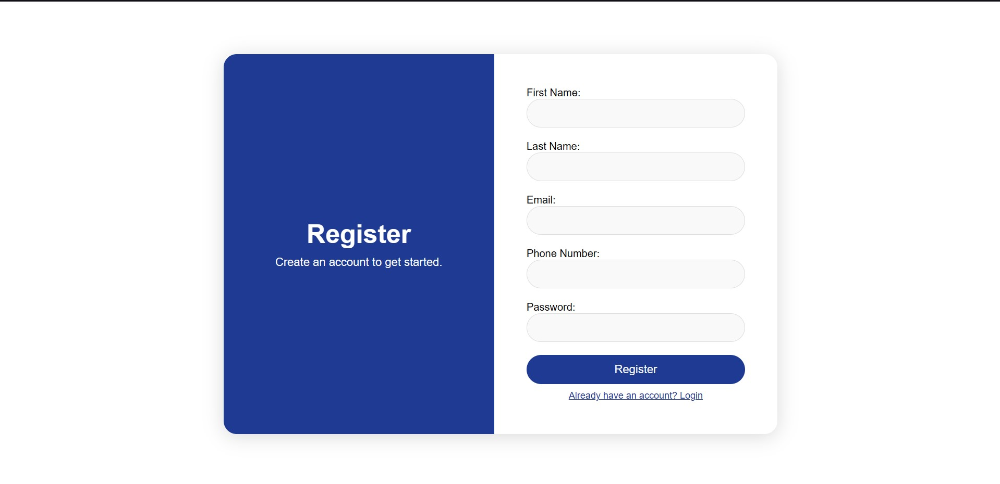

# Chatbot Car Parking - Number Plate Detection System
## Output

The **Output** folder contains the results generated by the system and visual representations of the application. Below are the included files:

### 1. Chatbot Interaction



The chatbot assists users in booking parking spots, answering queries, and interacting with the system seamlessly.

### 2. Login Page



The login page allows existing users to authenticate and access the parking system.

### 3. Registration Page



The registration page enables new users to create an account.

### 4. Number Plate Detection Demo

For the demo, see the video file: [Chatbot Interaction](Output/Output.gif).
---
### Chatbot Car Parking

This project is a complete **Chatbot Car Parking** system, consisting of three main components:

1. **Number Plate Detection**: Detects and extracts vehicle number plates from images using PaddleOCR and Ultralytics.
2. **Backend**: Manages authentication, parking bookings, and serves as an API that connects the frontend and number plate detection system.
3. **Frontend**: Provides a user interface for interacting with the parking system.

---

## Requirements

Before running the project, ensure you have the following installed:

- **Node.js** for the frontend.
- **Python 3.x** for the backend and number plate detection system.
- **MongoDB** for the backend database.

---

## Setup Instructions

### 1. Clone the Repository

Clone the repository to your local machine:

```bash
git https://github.com/alok-ahirrao/Car-Parking-Chatbot.git
cd Car-Parking-Chatbot
```

---

## Part 1: Backend Setup

### 2. Navigate to the Backend Folder

```bash
cd backend
```

### 3. Install Dependencies

Install the backend dependencies using `npm`:

```bash
npm install
```

This will install all required packages as defined in `package.json`.

### 4. Run the Backend Server

After installing the dependencies, start the backend server with:

```bash
node app.js
```

The backend server will start, and the API will be available for handling user requests.

---

## Part 2: Frontend Setup

### 5. Navigate to the Frontend Folder

```bash
cd ../frontend
```

### 6. Install Frontend Dependencies

Install the frontend dependencies using `npm`:

```bash
npm install
```

This will install all the required packages from `package.json`.

### 7. Start the Frontend Application

Once the dependencies are installed, start the frontend application with:

```bash
npm start
```

The frontend will be available at `http://localhost:3000`.

---

## Part 3: Number Plate Detection Setup

### 8. Navigate to the Number Plate Detection Folder

```bash
cd ../number_plate_detector
```

### 9. Create a Virtual Environment (Optional but Recommended)

Create a virtual environment for the Python-based number plate detection system:

```bash
python -m venv myenv
```

### 10. Activate the Virtual Environment

- On **Windows**:

```bash
.\myenv\Scripts\activate
```

- On **macOS/Linux**:

```bash
source myenv/bin/activate
```

### 11. Install Python Dependencies

Install the required Python dependencies for the number plate detection system:

```bash
pip install -r requirements.txt
```

### 12. Run the Number Plate Detection Application

After setting up the environment and installing dependencies, run the main Python script:

```bash
python main.py
```

This will start the number plate detection service, which will listen for incoming image recognition requests.

---

## Project Structure

```
Chatbot_Car_Parking/
│
├── number_plate_detector/        # Backend for number plate detection
│   ├── main.py                   # Main Python script for running the detection
│   ├── requirements.txt          # Python dependencies for detection
│   ├── myenv/                    # Virtual environment directory
│   └── weights/                  # Model weights for detection
│
├── frontend/                     # React frontend for user interaction
│   ├── node_modules/             # Dependencies installed via npm
│   ├── public/                   # Static files
│   ├── src/                      # Source code for the frontend
│   │   ├── components/           # UI components
│   │   ├── Login/                # Login page components
│   │   ├── Register/             # Registration page components
│   │   ├── App.js                # Main app component
│   │   └── index.js              # Entry point for React
│   └── package.json              # Frontend dependencies
│
├── backend/                      # Express backend
│   ├── controllers/              # Controllers for API logic
│   │   ├── authController.js     # Handles authentication
│   │   └── parkingController.js  # Handles parking bookings
│   ├── middleware/               # Middleware for authentication and error handling
│   │   └── auth.js               # Authentication middleware
│   ├── models/                   # Database models
│   │   ├── Booking.js            # Booking model
│   │   └── User.js               # User model
│   ├── routes/                   # API routes
│   │   ├── authRoutes.js         # Routes for authentication
│   │   ├── parkingRoutes.js      # Routes for parking
│   │   └── plateRoutes.js        # Routes for number plate recognition
│   ├── app.js                    # Main Express app setup
│   ├── locations.json            # Parking location data
│   ├── package.json              # Backend dependencies
│   └── package-lock.json         # Locked versions of backend dependencies
```

---

## Features

- **Number Plate Detection**: Uses PaddleOCR and Ultralytics to detect and extract vehicle number plates from images.
- **Backend API**: Handles authentication, parking bookings, and number plate recognition through an Express server.
- **Frontend**: Built with React, providing a user-friendly interface to interact with the car parking system.

---

## Troubleshooting

- **Backend**: If you encounter issues with the backend, ensure that MongoDB is running and that the `package.json` dependencies are correctly installed.
- **Frontend**: If the frontend doesn’t load, try clearing the `node_modules` and reinstalling dependencies with `npm install`.
- **Number Plate Detection**: If the detection doesn’t work, ensure that the Python dependencies are correctly installed and the virtual environment is activated.

---

## License

This project is copyrighted by Alok Ahirrao, but all rights are transferred to Ilytics Technology. The company holds the exclusive rights to use, modify, and distribute the code and its associated files.

All contributions made to this project are licensed under the Commercial License, granting Ilytics Technology full ownership and control over the software, including any modifications, enhancements, or derivative works.

For more information or inquiries, please contact the Ilytics Technology Legal Department or a company representative.

